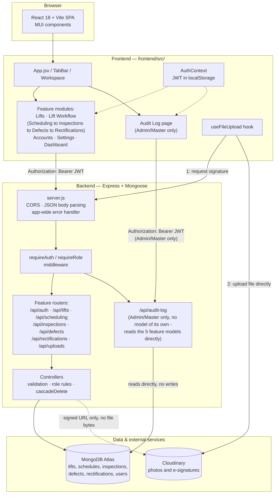

# Architecture Diagram

See `architecture.md` for the full written explanation. Diagram source below (GitHub renders
Mermaid blocks directly).

## Component notes

- **Client** — a single-page app; no server-side rendering.
- **Frontend shell vs. feature modules** — `App.jsx`/`TabBar.jsx`/`Workspace.jsx` are shared
  infrastructure (changes agreed on by the team); everything under `features/<name>/` is owned
  per feature.
- **Auth crosses every feature** — `AuthContext` and the `Authorization` header aren't specific
  to one module; every request from every feature carries the JWT the same way.
- **Uploads bypass the backend for file bytes** — the dashed arrow into Cloudinary from
  Controllers is signature-only; the solid arrow from the frontend's upload hook is the actual
  file transfer, which never touches our server.
- **One database, one backend process** — there's no per-feature service split; the boxes inside
  "Backend" are folders/modules within the same Express app, not separate deployables.
- **Audit Log has no model of its own** — unlike every other backend box, `/api/audit-log`
  isn't paired with a model; it reads the five feature models directly (see `architecture.md`'s
  "Audit Log" section). That's why it's drawn reading from Atlas independently of Controllers
  rather than through them, and why adding it required no change to `er-diagram.md`. Restricted
  to Admin/Master only — the one backend box every other feature's Staff role can't reach.

## Generating the PNG

This repo's Mermaid can't be rendered to a binary image file directly in this workflow. To
produce `architecture-diagram.png`:

1. Go to [mermaid.live](https://mermaid.live) (or paste into an AI diagram tool that accepts
   Mermaid/text prompts — see below).
2. Paste the Mermaid code block above into the editor.
3. Export as PNG (Actions → Download PNG) and save it as `design/architecture-diagram.png`,
   replacing the placeholder.

**If your tool takes a natural-language prompt instead of raw Mermaid**, use this:

> Draw a system architecture diagram for a full-stack web app. Top layer: a browser running a
> React + Vite single-page app with MUI components. Second layer, the frontend: an App shell
> (tab bar + workspace), a set of feature modules (Lifts; a combined "Lift Workflow" covering
> Scheduling → Inspections → Defects → Rectifications; Accounts; Settings; Dashboard), an
> Admin/Master-only Audit Log page, an AuthContext holding a JWT in localStorage, and a shared
> file-upload hook. Third layer, the backend: an Express server.js (CORS, JSON parsing, error
> handler), auth middleware (requireAuth/requireRole), a set of REST routers matching the
> frontend feature modules plus an uploads route, controllers that hold validation/business
> logic, and a separate Admin/Master-only audit-log route that has no model of its own and
> reads the other five feature models directly instead of going through Controllers. Bottom
> layer: MongoDB Atlas (as a database) and Cloudinary (as an external file-storage service).
> Arrows: the frontend feature modules call the backend routers with a Bearer-token JWT; the
> Audit Log page calls the audit-log route the same way; the upload hook gets a signed upload
> URL from the backend, then uploads the file directly to Cloudinary (bypassing the backend for
> file bytes); controllers read/write MongoDB Atlas; the audit-log route reads MongoDB Atlas
> directly. Use a clean layered/boxed style, label every arrow.
