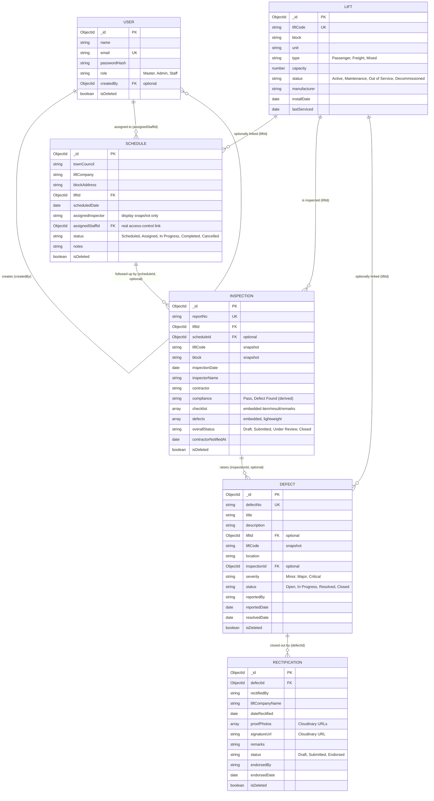

# ER Diagram

Six collections in one MongoDB Atlas database: `lifts`, `schedules`, `inspections`, `defects`,
`rectifications`, `users`. Diagram source below (GitHub renders Mermaid blocks directly).

## Entity/relationship notes

- **Lift → Schedule → Inspection → Defect → Rectification** is the client's actual workflow
  chain, and every link down the chain except the first is optional by design: a Schedule can
  exist before a Lift record does (`liftId` optional), an Inspection can be a walk-in with no
  prior Schedule (`scheduleId` optional), and a Defect can be logged standalone with no
  Inspection behind it (`inspectionId` optional, e.g. a tenant complaint). Only
  `Rectification.defectId` is required — a rectification only exists to close out a specific
  defect.
- **Snapshots vs. live references** — `liftCode`/`block` are copied onto Schedule/Inspection/
  Defect at creation time rather than always joined live, since these are historical records
  that shouldn't silently change if a lift's block gets reassigned months later. The FK
  (`liftId`) stays the source of truth for *which* lift; the snapshot is just for display.
- **Two different "defect" shapes** — `Inspection.defects` is an embedded array (lightweight
  findings tied to one specific report's checklist, `Open`/`Acknowledged`/`Verified` lifecycle),
  while `DEFECT` is its own top-level collection with a longer lifecycle
  (`Open → In Progress → Resolved → Closed`) and the thing Rectification actually attaches to.
  They intentionally coexist rather than one replacing the other.
- **`assignedInspector` vs. `assignedStaffId`** on Schedule — the former is free-text, kept only
  as a display snapshot; the latter is the real relational link to `USER`, used for Staff-role
  access scoping. A migration script backfills `assignedStaffId` from matching
  `assignedInspector` names where it can confidently match, leaving the rest `null` rather than
  guessing.
- **Soft delete, not hard delete** — every collection except `USER` (which uses `isDeleted` to
  mean "deactivated") uses `isDeleted` to mean "removed." Deleting a Schedule cascades
  `isDeleted: true` down through its Inspections → Defects → Rectifications rather than a hard
  delete, so the compliance/audit trail is never actually destroyed.
- **`USER.createdBy`** is self-referential (a User was created by another User) — used for
  auditability, not access control.

## Generating the PNG

Same approach as the architecture diagram:

1. Paste the Mermaid code block above into [mermaid.live](https://mermaid.live) (or an
   AI diagram tool that accepts Mermaid).
2. Export as PNG and save as `design/er-diagram.png`, replacing the placeholder.

**Natural-language prompt version**, if your tool takes a text prompt instead of raw Mermaid:

> Draw an entity-relationship diagram for 6 entities in one database: LIFT, SCHEDULE,
> INSPECTION, DEFECT, RECTIFICATION, and USER. LIFT connects one-to-many to SCHEDULE, INSPECTION,
> and DEFECT (all optional links from the many side). SCHEDULE connects one-to-many to
> INSPECTION (optional). INSPECTION connects one-to-many to DEFECT (optional). DEFECT connects
> one-to-many to RECTIFICATION (required — every rectification must reference exactly one
> defect). USER has a self-referential one-to-many relationship (a user can create many other
> users) and a one-to-many relationship to SCHEDULE (a user can be assigned many schedules).
> Show each entity as a box listing its key fields: LIFT (liftCode, block, unit, type, capacity,
> status), SCHEDULE (townCouncil, liftCompany, scheduledDate, status, assignedStaffId), INSPECTION
> (reportNo, inspectionDate, compliance, overallStatus), DEFECT (defectNo, title, severity,
> status), RECTIFICATION (rectifiedBy, dateRectified, status, endorsedBy), USER (name, email,
> role). Use standard crow's-foot ER notation, label each relationship line with what it
> represents.
